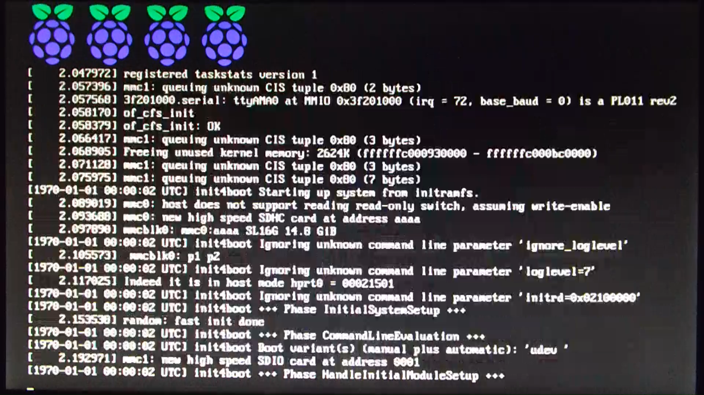

dib-element-raspberrypi3
########################

Element for diskimage-builder setting up Raspberry Pi 3 using arm64.

Features
++++++++

* Builds complete 64-bit arm64 system based on adaptable configuration
* Uses official up-to date Raspberry Pi kernel
* Uses official distribution arm64 - no need for special adapted
  versions like ``Raspberian``.

Tested
++++++

The following setups are known to be working

* Debian Stretch

Drawbacks
+++++++++

There are currently some GPIO libraries out there that relay on the
existance of some descriptions in the ``/proc/cpuinfo`` (like
``Hardware`` or ``Revision``).  This information is not (any longer)
available in the ``cpuinfo`` - and is now available in the device tree
``/proc/device-tree``.

Because the kernel and firmware related files (like ``start.elf`` or
``bootcode.bin``) are not part of the normal distribution, they will
not get updated automatically.

Setup
+++++

Before starting the build, there is the need to setup the build
environment.

diskimage-builder
-----------------
As the base that provides the infrastructure, the Openstack
diskimage-builder_ must is used.

.. _diskimage-builder: https://docs.openstack.org/developer/diskimage-builder/

Because some features are needed which are not merged, there is the
need to use the latest version and add some patches.  I'm currently
working on this and hopefully at some time the next steps are not
needed any longer.

::

   $ git clone https://git.openstack.org/openstack/diskimage-builder
   $ cd diskimage-builder
   $ git checkout -b feature/v2 origin/feature/v2

Then apply the following patches

* 426618_
* 414179_

.. _426618: https://review.openstack.org/#/c/426618/  

.. _414179: https://review.openstack.org/#/c/414179/

They can be e.g. cherry picked (see upper right corner of the page).

rpi3 module
-----------
The module itself needs some packages that must be installed. Look at
rpi3-readme_ for details.

.. _rpi3_readme: rpi/Readme.rst

Configuration
+++++++++++++

The configuration can be adapted in the ``create_rpi3.sh`` file.
You might want to change the Debian mirror to your needs.  If you
want, you can also change (or remove) the default user with username
``dib`` and password ``dib``.

Run
+++

::

   $ bash create_rpi3.sh

Install
+++++++

::

   $ dd if=rpi3-debian-minimal-stretch.raw of=/dev/your_mmc_device

Place the SD card into your RPi3 and have fun.

Post-Install
++++++++++++

Mostly no post-install procedures are needed. You might want to adapt
network configuration.  Also the installed system is minimal, i.e. if
you want to use the RPi3 with GUI, you have to install the appropriate
packages.

It works
++++++++

